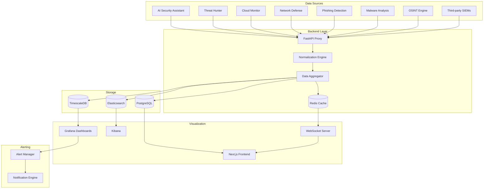

<p align="center">
  
  
  
  
  
  
  
</p>

<p align="center">
  <b>Unified SOC Command Center</b><br/>
  Real-time threat visualization, security posture overview, and AI-driven insights dashboard for your entire security infrastructure.
</p>

---

## 📋 Description

**Kirov Security Dashboard** is a centralized Security Operations Center (SOC) command center that aggregates telemetry from all Kirov security tools and third-party integrations into a single, high-fidelity visualization platform. It provides real-time threat monitoring, compliance posture tracking, and AI-powered analytical insights.

The dashboard connects to your existing security stack — SIEMs, EDRs, cloud security monitors, and threat intelligence feeds — to present a unified operational picture. With Grafana-powered custom dashboards, Kibana log correlation, and a React frontend with WebSocket-driven live updates, SOC analysts gain instant situational awareness.

---

## 🏗️ Architecture



---

## ✨ Key Features

- **📊 Unified SOC View** — Single-pane-of-glass visualization across all Kirov security products and third-party tools
- **⚡ Real-Time Updates** — WebSocket-powered live dashboards with sub-second latency for critical alerts
- **🧠 AI Insights Panel** — Natural language summaries of security posture, trending threats, and recommended actions
- **📈 Compliance Posture Tracking** — SOC 2, ISO 27001, PCI DSS, HIPAA, and GDPR compliance dashboards with evidence mapping
- **🔍 Drill-Down Investigation** — Click-through from dashboard widgets to detailed event timelines and raw log correlation
- **📉 Custom Grafana Dashboards** — Pre-built and customizable Grafana JSON dashboards for every Kirov product
- **🚨 Intelligent Alerting** — Multi-channel alert routing (Slack, PagerDuty, email) with noise reduction and deduplication
- **📋 Executive Reporting** — Automated report generation for CISO briefings with trend analysis and risk summaries
- **🔐 Role-Based Access** — Granular RBAC with SOC analyst, engineer, manager, and executive views
- **🌐 Multi-Tenant** — MSSP-ready architecture with isolated tenant workspaces
- **🔄 Log Correlation** — Kibana-powered log aggregation with cross-source correlation queries

---

## 🛠️ Tech Stack

| Category | Technology |
|----------|-----------|
| **Frontend** | Next.js 14 (React, TypeScript, TailwindCSS, Shadcn/ui) |
| **Backend** | FastAPI 0.110+ (Python 3.11+) |
| **Visualization** | Grafana 11+, Kibana 8+ |
| **Database** | TimescaleDB (time-series), PostgreSQL 16 (metadata) |
| **Search** | Elasticsearch 8 |
| **Cache** | Redis 7 |
| **Streaming** | Apache Kafka / Redpanda |
| **WebSocket** | Socket.IO (Python) |
| **Containerization** | Docker, Docker Compose |
| **Monitoring** | Prometheus, Loki |
| **Auth** | OAuth 2.0 / OIDC via Kirov Secure Auth System |

---

## 🚀 Quick Start

### Prerequisites

- Docker and Docker Compose
- Node.js 18+ and Python 3.11+
- Access to at least one Kirov security product (or mock data)

### Installation

```bash
# Clone the repository
git clone https://github.com/Raphasha27/kirov-security-dashboard.git
cd kirov-security-dashboard

# Copy environment configuration
cp .env.example .env
# Edit .env with your configuration

# Start all services with Docker Compose
docker compose up -d

# Or run components individually:
# Backend
cd backend
python -m venv venv
source venv/bin/activate  # Windows: venv\Scripts\activate
pip install -r requirements.txt
uvicorn app.main:app --reload --port 8000

# Frontend
cd ../frontend
npm install
npm run dev
```

### Load Grafana Dashboards

```bash
# Import pre-built dashboards
curl -X POST http://localhost:3000/api/dashboards/db \
  -H "Content-Type: application/json" \
  -d @dashboards/grafana/security-overview.json

# Repeat for each dashboard in the dashboards/grafana/ directory
```

### Verify Installation

Open `http://localhost:3000` for Grafana (default admin/admin) and `http://localhost:3001` for the Next.js frontend.

---

## 📡 API Overview

| Endpoint | Method | Description |
|----------|--------|-------------|
| `/api/v1/health` | GET | Health check |
| `/api/v1/metrics` | GET | All current security metrics |
| `/api/v1/metrics/:category` | GET | Metrics by category |
| `/api/v1/alerts` | GET | Active and historical alerts |
| `/api/v1/alerts/:id` | GET | Alert details |
| `/api/v1/compliance` | GET | Compliance posture summary |
| `/api/v1/events` | GET | Security event stream |
| `/api/v1/events/search` | GET | Log correlation search |
| `/api/v1/ws` | WS | WebSocket for real-time updates |
| `/api/v1/reports/generate` | POST | Generate executive report |

---

## 🔗 Integration with Kirov Ecosystem

The Security Dashboard is the central visualization layer for the entire Kirov platform:

| Component | Integration |
|-----------|-------------|
| **[AI Security Assistant](https://github.com/Raphasha27/kirov-ai-security-assistant)** | Displays vulnerability scanning results and trends |
| **[Threat Hunter](https://github.com/Raphasha27/kirov-threat-hunter)** | Visualizes hunt findings, IOC matches, and TTP mappings |
| **[Cloud Security Monitor](https://github.com/Raphasha27/kirov-cloud-security-monitor)** | Cloud posture scores and misconfiguration alerts |
| **[Network Defense Platform](https://github.com/Raphasha27/kirov-network-defense-platform)** | Network traffic anomalies and IDS/IPS alerts |
| **[Phishing Detection Engine](https://github.com/Raphasha27/kirov-phishing-detection-engine)** | Phishing campaign metrics and domain reputation |
| **[Malware Analysis Lab](https://github.com/Raphasha27/kirov-malware-analysis-lab)** | Malware detections and sandbox analysis results |
| **[OSINT Intelligence](https://github.com/Raphasha27/kirov-osint-intelligence)** | Threat actor profiles and dark web monitoring |
| **[Cyber Automation Engine](https://github.com/Raphasha27/kirov-cyber-automation-engine)** | Playbook execution status and SOAR metrics |

---

## 🔒 Security Considerations

- **API Gateway Authentication**: All backend API endpoints require OAuth 2.0 tokens validated via the Kirov Secure Auth System
- **Grafana Hardening**: Change default admin credentials immediately; configure OAuth or LDAP authentication
- **HTTPS Enforcement**: TLS termination required at the reverse proxy layer (Caddy, Nginx, or Traefik)
- **CORS Configuration**: Restrict allowed origins to trusted domains only
- **Rate Limiting**: Configure per-endpoint rate limits to prevent data exfiltration
- **Audit Logging**: All dashboard interactions and API calls are logged to Elasticsearch for SOC audit trails
- **Data Minimization**: Dashboard caches aggregate metrics; raw event details require explicit drill-down authentication

---

## 🗺️ Roadmap

- [ ] **Q3 2026** — AI-powered anomaly overlay on time-series dashboards
- [ ] **Q3 2026** — Custom dashboard builder with drag-and-drop widgets
- [ ] **Q4 2026** — Mobile SOC app with push notifications and incident response
- [ ] **Q4 2026** — SLA tracking and SOC team performance metrics
- [ ] **Q1 2027** — MITRE ATT&CK heatmap with real-time TTP coverage tracking
- [ ] **Q1 2027** — MSSP multi-tenant management console
- [ ] **Q2 2027** — SOC automation: auto-create Jira tickets from dashboard widgets

---

## 📄 License

This project is licensed under the **MIT License** — see the [LICENSE](LICENSE) file for details.

## 🙏 Attribution

Created and maintained by **Kirov Security Labs** — the research and development division of Kirov, dedicated to advancing AI-driven cybersecurity solutions.

<p align="center">
  <sub>One dashboard to rule them all. One SOC to secure them all.</sub>
</p>
